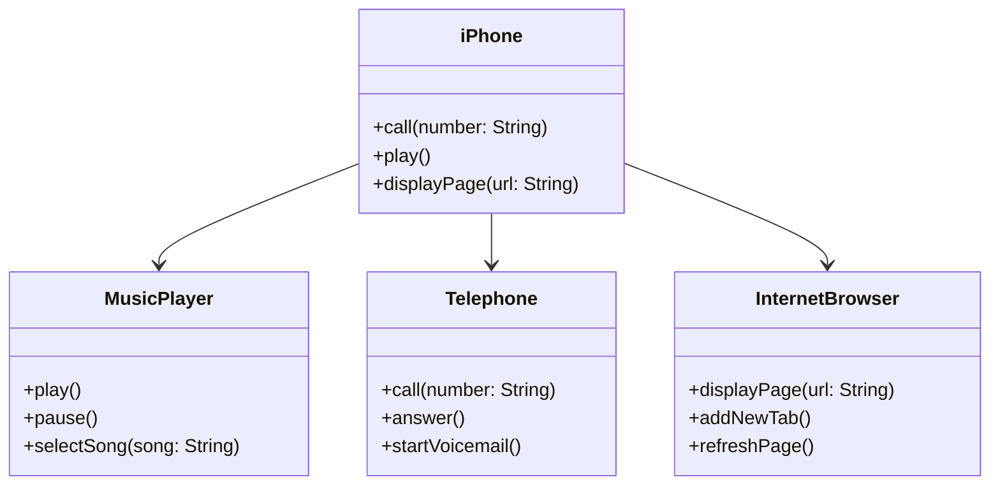

# UML Modeling

This is an example of a UML diagram. For illustrative purposes, we present a generic diagram representing some functionalities of the first **iPhone**.

To ensure this is a generic example with only three functionalities to illustrate.

